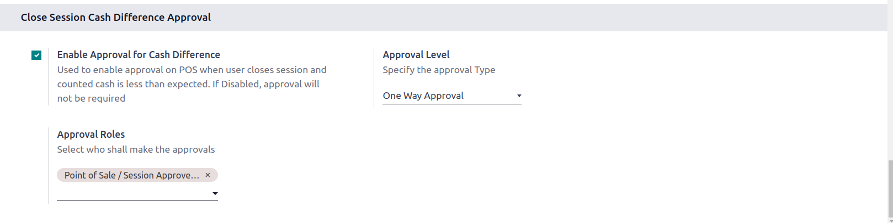
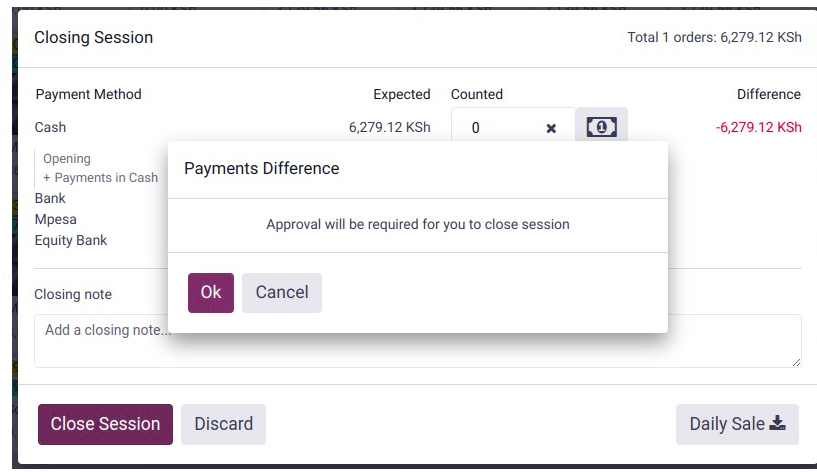
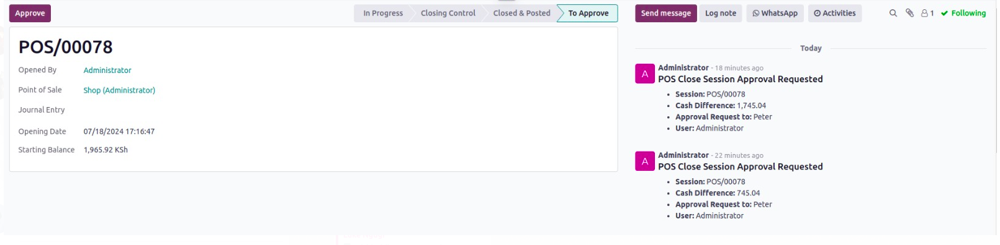
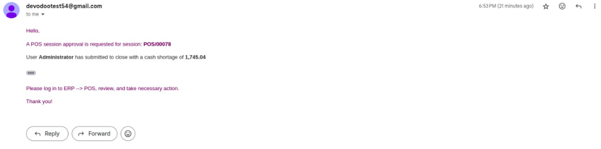

# POS Approval Customization Module

## Overview

This module adds an approval workflow for closing Point of Sale (POS) sessions in Odoo 17. It enforces an approval process when there is a cash difference between the expected and counted cash at the end of a session, based on the configuration in the POS settings.

## Table of Contents

1. [Installation](#installation)
2. [Configuration](#configuration)
3. [Usage](#usage)
4. [Technical Details](#technical-details)
    - [Model Changes](#model-changes)
    - [Template Changes](#template-changes)
    - [JavaScript Extensions](#javascript-extensions)
5. [Troubleshooting](#troubleshooting)
6. [License](#license)

## Installation
### Steps

1. Add the module `custom_pos_approval` to your custom modules list.
2. Navigate to Apps in Odoo, click on "Update Apps List," and then "Update."
3. Search for `custom_pos_approval` and install it.
4. Upgrade the module
## Configuration

1. Navigate to **Point of Sale** -> **Configuration** -> **Settings**.
   2. In the **Close Session Cash Difference Approval** section:
      - Enable the **Enable Approval for Cash Difference** checkbox.
      - Select the **Approval Level**: One Way or Two Way.
      - Set the **Approval Roles**: Specify user groups that will receive approval requests.

         
## Usage

1. **Closing a POS Session:**
   - When attempting to close a POS session, if there is a cash difference, a dialog will prompt the user that approval is required.
   - The session status will change to "Pending Approval" once confirmed.
   - Emails will be sent to the designated approvers based on the configuration.

   
   
   

## Technical Details

### Model Changes
- Inherited **pos.session** and **res.config.settings** to add the settings
- **pos.session**: added approval extra fields, status and implemented approval logic + notification logic

### Template/View Changes
- Changes to view_pos_config_kanban to add approval status view
- Added template for email notification
- Changes to view_pos_session_tree and view_pos_session_form to add button approve and status view

### JavaScript Extensions
- Patched ClosePosPopup JS to change the logic flow on approve enabled and added method to post approval

## Troubleshooting

1. **Approval Dialog Not Showing:** Ensure that the "Approval Required" setting is enabled in the POS configuration.
2. **Emails Not Being Sent:** Check the email server configuration and that the correct approvers are set.
3. **Approval Workflow Not Triggering:** Verify the configuration settings.

## License

LGPL-3
